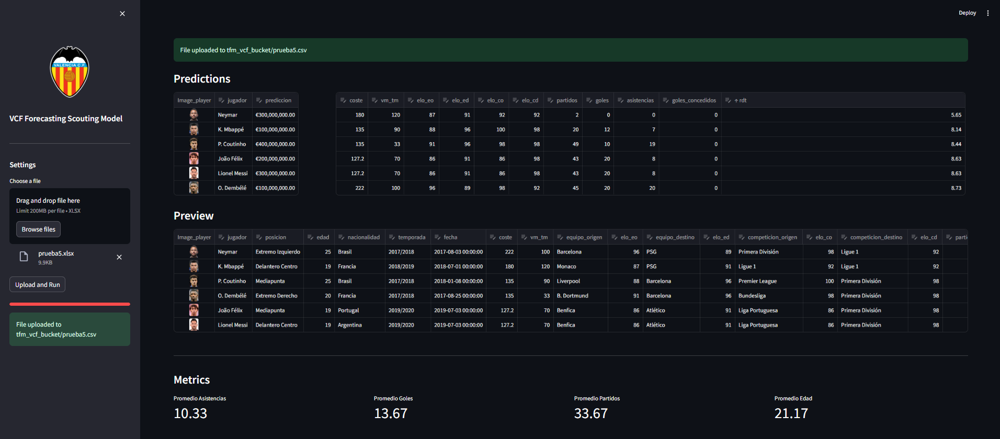
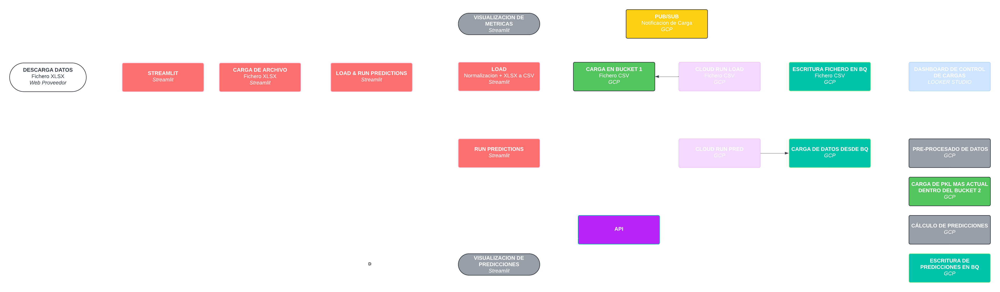

# VCF Forecasting Scouting Model

## Descripción

El **VCF Forecasting Scouting Model** es una aplicación web interactiva desarrollada con Streamlit, que permite a los usuarios analizar y visualizar datos de scouting de jugadores de fútbol. La aplicación utiliza datos cargados por el usuario para generar predicciones y visualizaciones que ayudan a evaluar el valor de mercado y el rendimiento de los jugadores.

## Funcionalidades

- **Carga de Datos**: Permite la carga de archivos Excel con información de jugadores.
- **Transformación de Datos**: Los datos cargados se transforman y se enriquecen con imágenes de jugadores.
- **Predicciones**: Realiza predicciones basadas en un modelo externo y muestra resultados en la interfaz.
- **Visualizaciones**: Incluye gráficos interactivos para la distribución de nacionalidades, distribución de goles y asistencias, comparación de coste vs valor de mercado, y un diagrama de Sankey para flujos de transferencia.

## Link Web
https://app-vcf-161031452234.us-central1.run.app/


## Link a Data Studio
https://lookerstudio.google.com/reporting/4839a9a6-6bda-4eae-9df6-7027d580f0af

## Stack Tecnológico

- **Python** 3.7 o superior
- **Streamlit**: Para la interfaz web
- **Pandas**: Para la manipulación de datos
- **Plotly**: Para las visualizaciones
- **Google Cloud**: Para interactuar con BigQuery y Google Cloud Storage
- **Scikit-Learn**: Para modelado y construccion de Scalers y *.pkl
- **Flask**: Framework para el desarrollo de la API y los Cloud Run. 


## Instalación para ejecución en local

1. Clona este repositorio:
    ```bash
    git clone https://github.com/tu_usuario/vcf-forecasting-scouting-model.git
    cd vcf-forecasting-scouting-model
    ```

2. Crea y activa un entorno virtual (opcional pero recomendado):
    ```bash
    python -m venv venv
    source venv/bin/activate  # En Windows: venv\Scripts\activate
    ```

3. Instala las dependencias:
    ```bash
    pip install -r requirements.txt
    ```

4. Asegúrate de tener las credenciales de Google Cloud configuradas y el archivo `tfm-vcf-1f05acc80f94.json` en la raíz del proyecto.

## Uso

1. Ejecuta la aplicación Streamlit:
    ```bash
    streamlit run app.py
    ```

2. Abre tu navegador web y accede a la dirección proporcionada por Streamlit (generalmente http://localhost:8501).

3. **Carga un archivo Excel**: Utiliza el botón para seleccionar un archivo `.xlsx` que contenga los datos de jugadores.

4. **Visualiza los resultados**: Después de cargar el archivo, la aplicación procesará los datos y mostrará visualizaciones interactivas, estadísticas y gráficos.

##





## Estructura del Código

- `app.py`: Archivo principal que contiene la lógica de la aplicación Streamlit.
- `funciones.py`: Contiene funciones auxiliares para transformar datos, subir archivos a Google Cloud Storage y obtener imágenes de jugadores.
- `requirements.txt`: Lista de dependencias del proyecto.
- `tfm-vcf-1f05acc80f94.json`: Archivo de credenciales para Google Cloud (debería estar en la raíz del proyecto).


## Workflow





## Team
- Juan Cornejo
- Jesus Orti
- Andres Cervera
- Cristian Marty
  


## Setup subscripcion canal de pubsub y actuliazación de clud run y bucket
- cloudrun_load>gcloud pubsub subscriptions modify-push-config eventarc-us-central1-trigger-bsyn7wmz-sub-326 --push-endpoint=https://cloud-run-load-osmqjiapya-uc.a.run.app/ --push-auth-service-account=161031452234-compute@developer.gserviceaccount.com
Updated subscription [projects/tfm-vcf/subscriptions/eventarc-us-central1-trigger-bsyn7wmz-sub-326].


## Comandos sdk
- gcloud auth login

- gcloud config set project tfm-vcf

- gcloud builds submit --tag gcr.io/tfm-vcf/cloud-run-train&gcloud run deploy cloud-run-load --image gcr.io/tfm-vcf/cloud-run-train --platform managed --region us-central1 --allow-unauthenticated
- gcloud builds submit --tag gcr.io/tfm-vcf/app-vcf&gcloud run deploy app-vcf --image gcr.io/tfm-vcf/app-vcf --platform managed --region us-central1 --allow-unauthenticated
